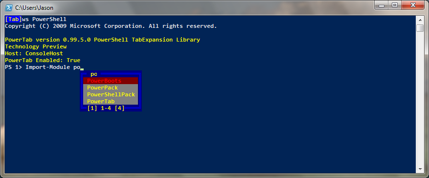

# Tab Item Selectors

PowerTab offers several options for shorting through the possible values presented by a tab expansion request. The normal way this is done in cmd.exe and PowerShell.exe is to present the first option based on the context after the user presses the TAB key, and then present the next option if the user presses the TAB key again (and the previous with SHIFT-TAB).

Additional tab item selectors are available in PowerTab that are designed to make it easier to choose from large lists of tab expansion options.

**Available Selectors**

There are currently three selectors available that are detailed in the sections below, **ConsoleList**, **Intellisense**, and **Default**. Also, there is the special setting **Dynamic** that will cause PowerTab to choose the best selector for your PowerShell host. This setting allows you to use PowerTab with multiple PowerShell hosts without needing multiple configurations.

Please refer to the [Host Support](Usage/HostSupport.md) page for information on which selectors are supported on each host.

**Setting the Selector to Use**

To choose the tab item selector to use in PowerTab, set the **DefaultHandler** setting to an appropriate value. If that tab item selector will not work in the current PowerShell host, PowerTab will quietly use the "Default" tab item selector. The **AlternateHandler** setting will be used for Double Tab (if enabled), and certain other situations, instead of **DefaultHandler**.

```PowerShell
$PowerTabConfig.DefaultHandler = "Dynamic"
$PowerTabConfig.AlternateHandler = "Dynamic"
```

## ConsoleList



The ConsoleList utilizes the raw console buffer to display a text based user interface to complement tab expansion. This has the advantage of living inside the console, so it will scroll with the rest of the buffer and can be copied as text.

**Configuring ConsoleList**

Setting | Values | Default | Function
------- | ------ | ------- | --------
$PowerTabConfig.MinimumListItems | [Int] | 2 | 
$PowerTabConfig.FastScrollItemCount | [Int] | 10 | The number of items to skip during fast-scroll (SHIFT-UP or SHIFT-DOWN)
$PowerTabConfig.CloseListOnEmptyFilter | $True or $False | $True | 
$PowerTabConfig.DotComplete | $True or $False | $True | If `$True`, then entering a period will accept the selection and replace the last word on the command line.
$PowerTabConfig.AutoExpandOnDot | $True or $False | $True | 
$PowerTabConfig.BackSlashComplete | $True or $False | $True | If `$True`, then entering a slash or backslash will accept the selection and replace the last word on the command line.
$PowerTabConfig.AutoExpandOnBackSlash | $True or $False | $True | 
$PowerTabConfig.SpaceComplete | $True or $False | $True | 
$PowerTabConfig.CustomComplete | $True or $False | $True | 
$PowerTabConfig.CustomCompletionChars | [String] | "]:)" | 


**Configuring ConsoleList Appearance**

Setting | Values | Function
------- | ------ | --------
$PowerTabConfig.DoubleBorder | $True or $False | 
$PowerTabConfig.Colors.TextColor | [ConsoleColor] | 
$PowerTabConfig.Colors.BackColor | [ConsoleColor] | 
$PowerTabConfig.Colors.SelectedTextColor | [ConsoleColor] | 
$PowerTabConfig.Colors.SelectedBackColor | [ConsoleColor] | 
$PowerTabConfig.Colors.FilterColor | [ConsoleColor] | 
$PowerTabConfig.Colors.BorderColor | [ConsoleColor] | 
$PowerTabConfig.Colors.BorderTextColor | [ConsoleColor] | 
$PowerTabConfig.Colors.BorderBackColor | [ConsoleColor] | 


**Key Map for ConsoleList**

Key | Function | Notes
--- | -------- | -----
Tab | Move Selection Down | Holding down SHIFT will cause TAB to move the selection up.
Up Arrow | Move Selection Up | Holding down SHIFT will cause up arrow to jump several lines up according to the $PowerTabConfig.FastScrollItemCount.
Down Arrow | Move Selection Down | Holding down SHIFT will cause down arrow to jump several lines down according to the $PowerTabConfig.FastScrollItemCount.
Page Up | Move Up One Page | 
Page Down | Move Down One Page | 
Right Arrow | Add Next Character to Filter | The character is taken from the current selection.
Left Arrow | Remove Last Character from Filter | The BACKSPACE key has the same function.
Period |  | See $PowerTabConfig.DotComplete above.
\ or / |  | See $PowerTabConfig.BackSlashComplete above.
Space |  | 
Enter | Accept Current Selection | The selection is used to replace the last word on the command line.
Letters or Numbers | Adds to Filter | The filter updates the list of available choices in real time.

## Intellisense


The Intellisense selector presents a list outside of the console that is more compact than the ConsoleList selector. However, shifting focus away from the list will cause it to close and add the currently selected item to the command line.


**Key Map for Intellisense**

Key | Function | Notes
--- | -------- | -----
Tab | Accept Current Selection | The selection is used to replace the last word on the command line
Up Arrow | Move Selection Up | 
Down Arrow | Move Selection Down | 
Right Arrow | Move Selection Down | 
Left Arrow | Move Selection Up | 
Page Up | Move Up One Page | 
Page Down | Move Down One Page | 
Enter | Accept Current Selection | The selection is used to replace the last word on the command line
Letters or Numbers |  | 

## Default

The Default selector will send all tab expansion options directly to the PowerShell host, where it will be presented in a way that the host chooses.