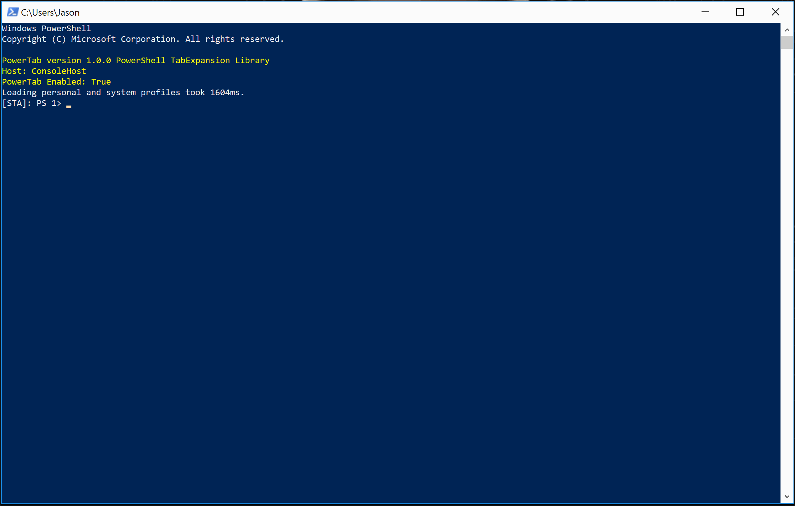

# PowerTab

Powertab is an extension of the PowerShell [tab expansion](http://docs.microsoft.com/en-us/powershell/scripting/core-powershell/console/using-tab-expansion?view=powershell-6) feature.



PowerTab offers enhanced tab expansion for PowerShell.

**Major Features:**
- **Context Sensitive** - Leverages the PowerShell parser for context appropriate tab expansion.
- **Extensible** - Offers extension points for additional contexts, such as other PowerShell modules or native applications, with [Tab Expansion Handlers](docs/Development/Handlers.md).
- **Supports Many PowerShell Hosts** - Works in any PowerShell host that runs tab expansion. See the [Host Support](docs/Usage/HostSupport.md) page.
- **New Interfaces** - Offers several GUI options for displaying tab expansion options using [Tab Item Selectors](docs/Usage/ItemSelectors.md).

## Install

Inspect

```powershell
Save-Module -Name PowerTab -Path <path>
```

Install

```powershell
Install-Module -Name PowerTab
```

## Help Index

- Setup
  - [Installing PowerTab](docs/Setup/Install.md)
  - [Configuration File Location](docs/Setup/ConfigFile.md)
  - [Tab Expansion Database](docs/Setup/TabDatabase.md)
- User Interface
  - [Tab Item Selectors](docs/Usage/ItemSelectors.md)
  - [Host Support](docs/Usage/HostSupport.md)
- Development
  - [Tab Expansion Handlers](docs/Development/Handlers.md)
