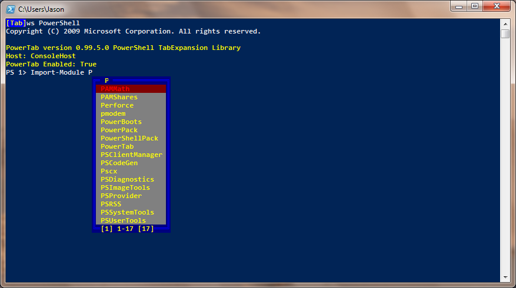

# PowerTab

Powertab is an extension of the PowerShell [tab expansion](http://technet.microsoft.com/en-us/library/dd315316.aspx) feature.

PowerTab offers enhanced tab expansion for PowerShell.

**Major Features:**
- **Context Sensitive** - Leverages the PowerShell parser for context appropriate tab expansion.
- **Extensible** - Offers extension points for additional contexts, such as other PowerShell modules or native applications, with [Tab Expansion Handlers](Docs/Development/Handlers.md).
- **Supports Many PowerShell Hosts** - Works in any PowerShell host that runs tab expansion. See the [Host Support](Docs/Usage/HostSupport.md) page.
- **New Interfaces** - Offers several GUI options for displaying tab expansion options using [Tab Item Selectors](Docs/Usage/ItemSelectors.md).

## Help Index

- Setup
 - [Installing PowerTab](Docs/Setup/Install.md)
 - [Configuration File Location](Docs/Setup/ConfigFile.md)
 - [Tab Expansion Database](Docs/Setup/TabDatabase.md)
- User Interface
 - [Tab Item Selectors](Docs/Usage/ItemSelectors.md)
 - [Host Support](Docs/Usage/HostSupport.md)
- Development
 - [Tab Expansion Handlers](Docs/Development/Handlers.md)